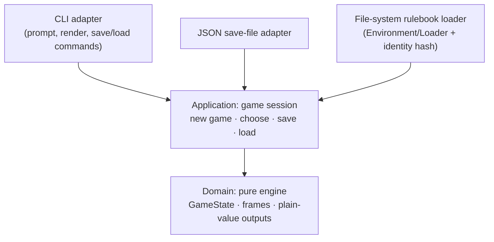

# Re-entrant VM: syml 1.0, a Pure Engine, Save/Load, and a Winnable Cloak

## Problem Frame

David wants to play `examples/cloak/` from start to finish, save partway, load the save, and win.
Today the CLI plays Cloak of Darkness, but badly. The diagnosis
(`specs/001-reentrant-vm/research.md`, D1 to D20) found the faults spread across all three suspected layers:

- **Runner.** The story begins twice (D1). Every opening choice has to be made twice, and `+=`
  givens apply twice. The runner base class has a broken contract (D14, D15).
- **VM.** A situation doesn't stop at a choice point (D2). The code after a choice (the
  "gather") runs before the player chooses, and it only looks right because the console runner
  blocks inside an event handler. Whether a finished situation pops depends on unrelated queue
  state (D3). Givens mutate live qualities in place (D13).
- **Events.** Blinker signals are named and process-global, so two sessions cross-talk (D6).
  Events hold live mutable `State` objects and non-serializable callables (D7, D8). Some
  annotations are wrong (D9) and the firing order is inverted (D4).
- **Termination.** The game cannot end (D10). `**You have won**` is plain text, and a situation
  with zero choices soft-locks the CLI (D11).
- **Blocking dependency.** syml 1.0 changes how a list under `- when:` / `- choice:` /
  `- effect:` must be indented (CHANGELOG item 17). Every example file fails to load under it.

Nothing about the current design can be saved: play state lives in a queue of bound methods,
blinker signals, compiled objects on the stack, and suspended Python frames (diagnosis §3.2).
The fix is to build the engine that `docs/RAVEL_VM_SPEC.md` already describes. It's pure and
driven from outside one call at a time. It returns plain-value outputs, and its whole state is a
small immutable value that serializes cleanly.

Dependencies point inward only. The domain imports nothing from the layers above it.

## Requirements

**Dependency upgrade (hard prerequisite)**

- R1. Ravel depends on syml 1.0 or later, below 2.0.
- R2. All example stories, inline test fixtures, and the language spec's examples are re-indented
  per syml CHANGELOG item 17. After re-indenting, each example must parse to the same data it
  produced under 0.6.2.
- R3. The mypy override that ignores missing syml stubs is removed, since syml 1.0 ships type
  information.
- R4. The full existing suite passes, at 100% branch coverage, before any VM work begins.

**Pure re-entrant engine**

- R5. The engine is driven by two calls, "start a game" and "choose a location". Each call takes
  the current game state and returns a new game state plus the outputs it produced. There are no
  callbacks, no pub/sub, and no module-level mutable state.
- R6. Game state is an immutable value holding:
  - the qualities;
  - a stack of frames, each a situation location plus an instruction position;
  - a status (running, waiting for input, or halted);
  - the currently offered choices, as location IDs in display order;
  - the halt outcome, when halted.
- R7. Outputs are immutable values holding only plain data (strings, numbers, booleans, and
  tuples of them). They never hold a reference to engine state, and never a callable. The output
  kinds are: text shown (with its glue flag), choices offered, quality changed, situation
  entered, situation exited, and halted.
- R8. A situation stops at its choice block and waits. Directives after the choice block (the
  gather) run only after the player has chosen and the chosen sub-situation has finished (D2).
- R9. When a situation runs past its last directive, it pops, every time, regardless of any other
  pending work (D3).
- R10. With an empty stack, the engine queries the rulebook and offers every matching situation.
  The menu order is deterministic and documented. It keeps today's order (predicate count
  descending, then location name descending) and a test pins it (D17).
- R11. If a query matches nothing, the engine halts with a distinguishable "dead end" outcome.
  It never offers an empty menu (D11).
- R12. Givens apply exactly once, when a new game starts. They are never re-applied, including
  on load (D1, D13).
- R13. Two games in one process never affect each other (D6).
- R14. Choosing a location that isn't currently offered, or choosing while not waiting for input,
  is rejected with a clear error, and the state is left unchanged.

**Ending the game**

- R15. The language gains one directive, `- end:`, with an optional outcome label
  (`- end: won`). Reaching it halts the whole game immediately, at any stack depth, and reports
  the label in the halted output. It is legal anywhere a directive is, including inside a choice.
- R16. Cloak of Darkness uses it. Reading the intact message ends the game as `won`. Reading the
  scrambled message ends it as `lost`.

**Save and load**

- R17. A save file is JSON, written in a canonical form (sorted keys, fixed separators), and it
  holds:
  - a format version;
  - the story's identity (a hash of the compiled rulebook);
  - the qualities, with their int, float, or string types preserved;
  - the frame stack;
  - the status and halt outcome;
  - the offered choices, as location IDs.
- R18. Loading restores that state exactly and never re-runs givens. It re-presents the pending
  menu, with labels re-derived from the saved location IDs.
- R19. Loading refuses, with a clear error that names the problem, when:
  - the story has changed since the save (identity mismatch);
  - the file is corrupt or missing required fields;
  - the format version is unsupported;
  - the file references locations the story doesn't have.

  A refused load never leaves a half-loaded game behind.
- R20. Determinism: saving, loading, and then making the same choices produces exactly the same
  outputs and final state as continuing without the save. The saved files come out
  byte-identical.

**CLI**

- R21. The CLI is a thin adapter over the session. It renders outputs, prompts, and passes a
  location ID back. The run loop ends when the game halts, printing the ending and the outcome.
- R22. At the prompt, these commands are available:

  | Input | Action |
  |---|---|
  | a number | Choose that menu item |
  | `save [FILE]` | Write a snapshot (default `ravel-save.json` in the current directory) and keep playing |
  | `load [FILE]` | Replace the current game with the snapshot and re-show its menu. A refused load keeps the current game. |
  | `s` | Show qualities (existing) |
  | `q` | Quit (existing) |
  | `help` or `?` | List these commands |

- R23. `ravel run DIR --load FILE` starts from a save instead of a new game. `DIR` is still
  required, because the save is checked against that story. A mismatch or a corrupt file exits
  non-zero with the error.
- R24. The existing CLI intents survive the rewrite:
  - `q` quits;
  - EOF and Ctrl-C exit cleanly;
  - bad input is rejected and the prompt repeats;
  - `--verbose` narrates quality changes and situation entry and exit;
  - `--debug` opens the post-mortem debugger on a crash.

**Verification**

- R25. End-to-end tests play Cloak to a win and to a loss. They select choices by location ID or
  label, never by menu position.
- R26. A property-based test drives random choice sequences through Cloak. Choice indices are
  taken modulo the current menu size, each sequence stops at halt, and the save point is random.
  It asserts R20 over at least 200 examples. Hypothesis becomes a dev dependency.
- R27. A minimal test-fixture story covers what Cloak can't:
  - a gather after a choice (R8);
  - a zero-match dead end (R11);
  - a `+=` given applied once (R12).

**Architecture, typing, and docs**

- R28. The code is layered Clean Architecture style:
  - **domain:** engine, state, and outputs;
  - **application:** the session use cases (new game, choose, save, load) and their ports;
  - **adapters:** the CLI, the JSON save store, and the file-system rulebook loader.

  The domain depends on nothing outward, and nothing under the domain imports blinker.
- R29. The new and rewritten packages are fully annotated and type-checked with
  `check_untyped_defs` or stricter. Coverage stays at 100% branch. Ruff, mypy, and pre-commit are
  clean.
- R30. Docs are updated:
  - `CLAUDE.md`'s architecture section;
  - `docs/RAVEL_VM_SPEC.md`, marking what's implemented and what's deferred, plus the menu-order
    rule;
  - `docs/RAVEL_LANGUAGE_SPEC.md`, covering the `end` directive (§9, §10.2, §11.2) and the
    re-indented examples;
  - `README.rst`, for the save/load run instructions.
- R31. `examples/cloak/rooms.ravel` is deleted (D19).

## Success Criteria

- A scripted Cloak playthrough reaches the win text and the game halts with outcome `won`. A
  second one reaches the scrambled text and halts with `lost`. No choice is ever asked twice, and
  no menu is offered after the halt.
- A save taken mid-game, loaded into a fresh process, finishes the game exactly as the
  uninterrupted run would. This holds for 200 or more random playthroughs.
- A human can run `uv run ravel run examples/cloak`, type `save`, quit, run it again with
  `--load ravel-save.json`, and win.
- The engineering gates hold: 100% branch coverage, and ruff, mypy, and pre-commit are clean.

## Scope Boundaries

- **Quality layers** (location, session, player, global; VM spec §3): not in scope. There is
  one flat quality map.
- **HATEOAS or stateless-server mode** (VM spec §7.5): not in scope, though the pure engine
  makes it possible later.
- **Ink `<>` glue rendering**: the engine carries the flag on text outputs, but the CLI
  doesn't render glue (D16).
- **Visit counts, once-only choices, and RNG**: none exist today, and none are added.
- **Menu-order redesign** (D17): only documented and pinned, not changed.
- **Conditional `end`** (a predicate prefix on `end`): not added. Rule predicates already cover
  it.
- **Cloak story semantics beyond the two `end` directives**: unchanged. That includes the shared
  `Bar` counter (D20).
- **Latent syml 1.0 semantics** that no current file triggers: not handled here. These are items
  1, 4, 19–21, and 20's paragraph-break question (diagnosis §1.3).

## Key Decisions

- **Build to `docs/RAVEL_VM_SPEC.md` instead of patching the current VM.** D2 and D3 are
  structural. A patch would keep the queue, the signals, and the suspended-frame state that make
  saving impossible.
- **The engine API takes location IDs, not menu indices.** Location IDs are stable across menu
  order and are what the save file stores. Mapping a number to a location is the CLI's job.
- **Save files store location IDs, which decouples the save format from menu order.** That is
  why D17 can stay as it is for now without making saves fragile.
- **The story's identity is a hash of the compiled rulebook, not file mtimes.** A cosmetic edit
  that doesn't change the compiled output doesn't invalidate saves. Any edit that does change it
  refuses the load, because instruction positions are only meaningful against the same
  compilation.
- **Constitution amendment required (MAJOR) — for the plan's Constitution Check.**
  - Principle VII currently *mandates* that the VM expose itself through frozen attrs events
    over blinker signals.
  - Principle VI lists `vm/events.py`, `vm/signals.py`, and the `send_input` callable as
    public API.

  This feature removes all of these. VII must be rewritten to describe the
  domain/application/adapter layering, and VI's public surface must swap to the session API,
  the output values, and the save format.

## Decided while you slept

These were settled without David, from his request and the diagnosis. Each is easy to revisit.

| # | Decision | Why | How easy to reverse |
|---|---|---|---|
| 1 | Story order: US1 syml 1.0 → US2 engine → US3 `end` → US4 save/load → US5 CLI → US6 end-to-end tests. US1 is a hard prerequisite. | Nothing loads under 1.0 until the re-indent lands, and every later story builds on the one before it. | Easy. It's only sequencing. |
| 2 | The tests that pin buggy behaviour may be deleted and replaced: `test_vm_states.py`, `test_vm_machine.py`, `test_runners.py`, and the runner parts of `test_cli.py`. Compiler, grammar, parser, and query tests are kept. | They assert D1–D8 as correct. Porting them would preserve the bugs. | Moderate. They stay in git history, but they test code that's being deleted. |
| 3 | Deferred: quality layers, HATEOAS mode, `<>` glue rendering, visit counts, and RNG. D17 is documented and pinned, not redesigned. | None is needed to play, save, load, and win. | Easy. Each is additive later. |
| 4 | Blinker is removed from the core. Whether the CLI keeps any pub/sub is left to planning. | Global named signals caused D6, and callbacks caused D2. | Easy for the CLI. Hard to put back in the domain, by design. |
| 5 | Three layers: domain, application, adapters. | That's the Clean Architecture style asked for, and it lets a future web runner reuse the session. | Moderate. It shapes the package layout. |
| 6 | New packages get full annotations and `check_untyped_defs` or stricter, with 100% branch coverage. | The looser setting is what let D9 through. | Easy. It's config. |
| 7 | Docs updated: CLAUDE.md, both specs, and the README. | Constitution IV ties behaviour to the specs. | Easy. |
| 8 | `examples/cloak/rooms.ravel` is **deleted**. | Nothing includes it, and its `Foyer == 1` predicate never holds. It duplicates `foyer.ravel` and fails under syml 1.0. | Trivial (`git restore`). |
| 9 | End directive syntax is `- end: <outcome>`, with the outcome optional. | See the first item under "For David to review". | Easy before release. It's one directive, one compile rule, and one handler. |
| 10 | CLI save/load UX is `save [FILE]` / `load [FILE]` at the prompt (default `ravel-save.json`), plus `ravel run DIR --load FILE`. Saving overwrites without asking. | A plain-word command is the least to learn, and a file in the current directory is the least surprising place for it. | Easy. It lives only in the adapter. |
| 11 | Menu order is kept as predicate count descending, then location name descending. | "Don't redesign," and saves don't depend on it. | Easy. It's one sort key plus its pin test. |
| 12 | A refused load keeps the current game at the prompt. With `--load` at startup, it exits non-zero. | Never lose a live game to a bad file. | Easy. |

## Dependencies / Assumptions

- syml 1.0.0 is available (the diagnosis used an editable install from `../syml/src`). Planning
  must confirm it resolves from the index, or pin a path or git source, so `uv.lock` is
  reproducible.
- Python 3.14 is already the floor. No interpreter upgrade is needed.
- The diagnosis's repro scripts in the scratchpad are reference material only, not deliverables.

## Outstanding Questions

### Resolve Before Specify

None. The specification is written (`specs/001-reentrant-vm/spec.md`).

### For David to review

1. **`end` directive syntax.**
   - Chosen: `- end: won`. The outcome label is optional and free text, carried verbatim in the
     halted output and printed by the CLI.
   - Why it fits:
     - It sits in the `when:` / `choice:` / `effect:` keyed-directive family.
     - It maps directly onto the VM spec's `HALT(reason)`.
     - `end` satisfies syml 1.0's key rule (item 4).
     - It collides with nothing in the reserved words (Language spec §13.A).
   - Alternatives considered:
     - `- halt:`: VM jargon in an author-facing language.
     - `- finish:`: fine, but less conventional.
     - An effect on a reserved quality (`- effect: Ended = 1`): it hides control flow inside
       data, and the engine would have to check after every effect.
     - Making the ending text itself the label (`- end: You have won`): it mixes narrative with
       outcome, and tests can't assert on a stable label.

   If you prefer another keyword, it's a one-line rename in the compiler plus the docs.
2. **`s` versus `save`.** `s` still shows qualities, as it does today. A player might type `s`
   expecting to save. Options:
   - keep it;
   - rename it to `qualities`;
   - make `s` require the full word `status`.
3. **Deleting `rooms.ravel`.** If it was a sketch you meant to keep, the alternative is to move
   it out of `examples/cloak/` rather than include it, since including it would add a second
   `foyer` rule.
4. **Constitution amendment wording** for Principles VI and VII (MAJOR bump). The planner will
   draft it, and it needs your sign-off.
5. **Menu order** (D17). Ties currently break reverse-alphabetically, which gives foyer menus
   like `outside, foyer, cloakroom, bar`. If you'd rather have source order, it's a small
   follow-up. Saves are unaffected.

### Deferred to Planning

- [Affects R6, R17][Technical] How exactly the rulebook identity hash is derived, and whether
  source positions are excluded so cosmetic edits don't invalidate saves.
- [Affects R8, R10][Technical] Whether choice blocks compile to explicit instructions (VM spec
  §8.2) or the engine interprets today's `BeginChoices` / `Choice` / `GetChoice` directives with
  a yield point. Either satisfies R8.
- [Affects R15][Technical] Whether directives after `end` get a compile-time warning. The
  default is no warning: they're simply unreachable.
- [Affects R28][Needs research] Whether blinker is still needed anywhere. If not, drop it
  from runtime dependencies.
- [Affects R1][Needs research] syml 1.0's availability on the package index versus a path
  source.

## Next Steps

→ `/sp:03-plan` (the specification at `specs/001-reentrant-vm/spec.md` is already written).
